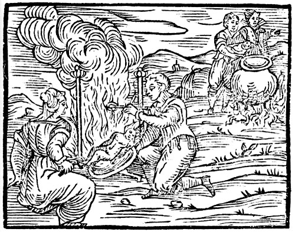
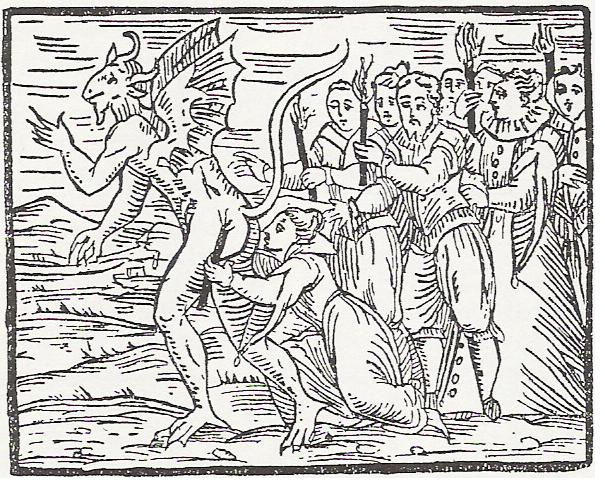
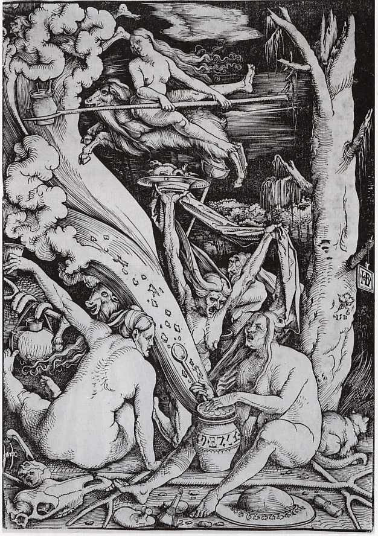
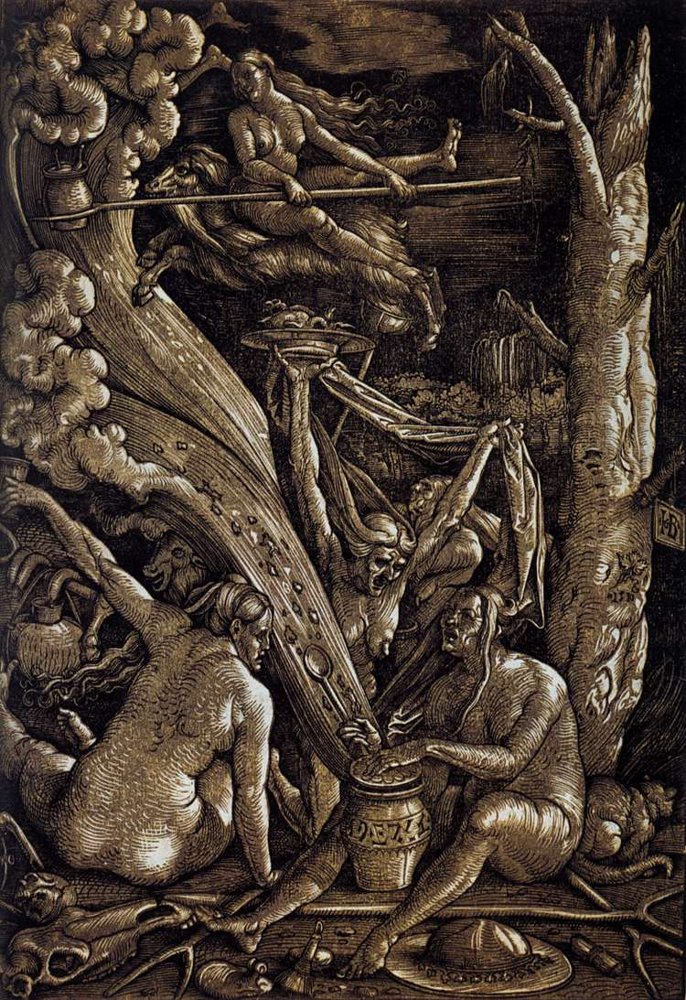

# A bruxa como figura visual: o *Malleus Maleficarum* como dispositivo de enquadramento entre a dogmática penal e a imagem (séculos XV–XVIII)

**Ana Vitória Vanzin Mendes**
PPGD/UFSC — Disciplina DIR410346 (História do Direito Penal e da Justiça Criminal)

---

## Resumo

O artigo propõe que a bruxaria moderna não é um tipo penal que a dogmática descreve e a iconografia ilustra, mas uma figura visual produzida por um dispositivo de enquadramento que opera simultaneamente no texto (*Malleus Maleficarum*, 1487), na categoria (*Disquisitiones Magicae* de Del Río, 1599) e na imagem (*Compendium Maleficarum* de Guazzo, 1608; gravuras de Baldung Grien e Dürer). A imagem não ilustra o crime: ela o constitui como figura visível, reconhecível e processável. O marco teórico cruza Sbriccoli (justiça hegemônica como aparato de enquadramento) com Sontag (a imagem como fabricação que apaga seus rastros), este último mobilizado como lente heurística declarada. O processo de Maria Gonçalves Cajada (Bahia, 1591-1593) é tomado como teste crítico: nele, a imagem europeia do sabá e da cópula demoníaca se deforma, e a ré opera no interior da moldura, esvaziando-lhe o conteúdo. Conclui-se que a deformação colonial é iconográfica antes de dogmática, e que a "violência do enquadramento" nomeia uma anterioridade da violência penal que a historiografia jurídica clássica não mapeou.

**Palavras-chave:** história do direito penal; iconografia da bruxaria; Malleus Maleficarum; justiça hegemônica; Inquisição colonial.

---

## Abstract

The article argues that early modern witchcraft is not a criminal type described by dogmatics and illustrated by iconography, but a visual figure produced by a framing device operating simultaneously in text (*Malleus Maleficarum*, 1487), in categories (*Disquisitiones Magicae* by Del Río, 1599), and in image (*Compendium Maleficarum* by Guazzo, 1608; engravings by Baldung Grien and Dürer). The image does not illustrate the crime: it constitutes it as a visible, recognizable, and processable figure. The theoretical framework crosses Sbriccoli (hegemonic justice as a framing apparatus) with Sontag (the image as fabrication that erases its traces), the latter mobilized as a declared heuristic lens. The trial of Maria Gonçalves Cajada (Bahia, 1591-1593) is taken as a critical test: in it, the European image of the sabbath and demonic copulation deforms, and the defendant operates within the frame, emptying its content. It concludes that the colonial deformation is iconographic before being dogmatic, and that the "violence of framing" names an anteriority of penal violence that classical legal historiography has not mapped.

**Keywords:** history of criminal law; iconography of witchcraft; Malleus Maleficarum; hegemonic justice; colonial Inquisition.

---

## 1. Introdução: o problema — a bruxa como figura

A análise historiográfica do direito penal exige o abandono das categorias naturalizadas pela dogmática contemporânea. Quando nos voltamos para a chamada "caça às bruxas" na Europa moderna e sua recepção no espaço atlântico colonial, deparamo-nos não com uma realidade fática preexistente, mas com um complexo processo de criminalização e construção doutrinária de um tipo penal. A bruxaria não é um objeto que a lei encontrou no mundo; é um objeto que a lei produziu. Este artigo radicaliza essa premissa: a bruxa não é apenas uma categoria jurídica construída — é uma figura visual produzida por um dispositivo de enquadramento que opera simultaneamente no texto, na categoria e na imagem.

O problema historiográfico que orienta este trabalho é, portanto, o seguinte: como uma figura visual se estabiliza doutrinariamente como tipo penal, e como ela se transforma ao circular entre contextos jurídicos e visuais distintos? A tese aqui defendida é que o *Malleus Maleficarum* (1487), de Heinrich Institoris, opera como dispositivo de enquadramento em estado puro — produz a bruxa como figura antes de prová-la como fato. A iconografia posterior (Guazzo, Baldung, Dürer) não ilustra uma dogmática preexistente: ela co-produz o tipo penal, fixando-o como imagem reproduzível e reconhecível.

O método proposto cruza dois referenciais aparentemente distantes. Mario Sbriccoli fornece a estrutura: sua dialética entre justiça negociada e justiça hegemônica permite ler a perseguição à bruxaria como momento de publicização do penal. Susan Sontag fornece o vocabulário: sua teoria da imagem como fabricação que se faz passar por realidade permite nomear o gesto institoriano de produzir uma figura e apresentá-la como prova. O cruzamento é inédito: a revisão sistemática da literatura indica que Sbriccoli, embora tenha produzido um método de leitura iconográfica do direito penal, o restringiu à alegoria da Justiça (o julgador), jamais à figura do julgado; e que Sontag jamais foi trazida para dialogar com a historiografia jurídica italiana ou com a iconografia demonológica moderna.

O caso de Maria Gonçalves Cajada (Bahia, 1591-1593) é tomado como teste crítico. Nele, a imagem europeia do sabá e da cópula demoníaca não se sustenta — e é precisamente essa falha que confirma a natureza iconográfica do tipo: norma jurídica não se deforma por contato, imagem sim. A ré, por sua vez, opera no interior da moldura imposta, esvaziando-lhe o conteúdo — resistência que só se torna legível quando o auto é lido como documento iconográfico.

## 2. Marco teórico: Sbriccoli × Sontag

### 2.1 Sbriccoli e a hegemonia como aparato de enquadramento

Sbriccoli (2001) diagnostica a transição gradual entre dois modelos concorrentes de justiça na Europa medieval e moderna. A *giustizia negoziata* (justiça negociada), de base comunitária e consensual, operava sob a égide da composição, da mediação e do restabelecimento da paz entre linhagens; a infração era compreendida como dano intersubjetivo passível de transação. Gradativamente, a partir da expansão do poder régio e eclesiástico, consolida-se a *giustizia egemonica* (justiça hegemônica). Sob este modelo, o delito deixa de ser disputa entre partes e passa a ser concebido como afronta à comunidade política (*laesa maiestas*) e à ordem divina. A persecução penal torna-se monopolística, a ação penal publiciza-se via processo inquisitório e a pena adquire contornos de espetáculo punitivo ([Sbriccoli, 2001](http://journals.openedition.org/chs/693)).

Nesse cenário, a heresia e, subsequentemente, a bruxaria emergem como crimes de exceção por excelência. A "bruxa" é construída como o avesso do sujeito de direito moderno. A releitura aqui proposta é que a justiça hegemônica não apenas pune: ela enquadra. O aparato inquisitório produz o sujeito de crime como figura visível antes de prová-lo como fato. É essa anterioridade — a fabricação da figura — que Sbriccoli intuiu mas não desenvolveu: sua própria leitura iconográfica do direito penal ficou confinada à alegoria da Justiça (a venda, a espada, a balança), isto é, à imagem do julgador ([Sbriccoli, 2003/2005](https://journals.openedition.org/chs/pdf/382); [Meccarelli](http://journals.openedition.org/chs/693); [Zorzi](http://www.rmoa.unina.it/1677/1/RM-Zorzi-Sbriccoli.pdf)). Ele jamais voltou seu método para a figura do julgado — a bruxa, a herege. Esse ponto cego é o espaço exato que este artigo ocupa.

### 2.2 Sontag e a imagem como fabricação

Susan Sontag oferece o vocabulário que falta. Em *Sobre fotografia* (1977), sustenta que a imagem não representa o real: ela o substitui, ela o constitui. A fotografia "passa por prova incontestável de que uma coisa aconteceu", e sua agressão está oculta sob a transparência da prova (SONTAG, 2004). Em *Contra a interpretação* (1964), critica a hermenêutica que extrai um "sentido oculto" por trás da superfície: o projeto clássico da interpretação é escavar, transpor, para alcançar um substrato que se supõe verdadeiro. Em *Diante da dor dos outros* (2003), precisia: enquadrar é selecionar, e selecionar é exercer poder.

A mobilização de Sontag é declarada como lente heurística, e exige uma justificativa metodológica. Uma teórica da imagem do século XX para ler um manual demonológico do século XV pode soar, à primeira vista, como anacronismo. Não o é, por três razões. Primeiro, porque a história do direito contemporânea é transdisciplinar por natureza: Sbriccoli mobiliza Foucault, Laura de Mello e Souza mobiliza a história cultural (SOUZA, 1986); o direito é prática cultural densa, e perguntar como uma categoria penal é fabricada exige ferramentas que deem conta da produção de sentido. Segundo, porque o próprio objeto exige essa lente: se o *Malleus* é ele mesmo um artefato visual — um manual de reconhecimento que descreve a bruxa antes de prová-la —, ler com uma teoria da imagem é adequação ao objeto, não extrapolação. Terceiro, porque a deformação atlântica do tipo confirma sua natureza iconográfica: se o tipo fosse puramente dogmático, viajaria intacto; mas se deforma — comportamento de imagem em circulação, não de norma. Sontag é lente, não voz atribuída aos agentes do século XVI.

### 2.3 O cruzamento: a "violência do enquadramento"

Sbriccoli dá a estrutura (o aparato); Sontag dá o estágio anterior (a fabricação da figura). O cruzamento permite formular um conceito próprio: a "violência do enquadramento" — a violência de fazer existir alguém como figura de crime antes de puni-lo. Onde a historiografia clássica vê publicização da ação e espetacularização da pena, a lente sontaguiana permite ver o estágio anterior: a produção de visibilidade do sujeito processável. Quem é punido é, primeiro, quem foi feito visível como punível. Ler o tipo penal como imagem é pensar o direito penal não apenas como técnica de punição, mas como técnica de visibilidade.

## 3. O dispositivo textual: o *Malleus* como imagem escrita

Antes do final do século XV, inexistia na Europa uma categoria jurídica estável sob o nome de "bruxaria". O direito penal operava com tradições fragmentadas: o *maleficium* (dano concreto por meios mágicos, regulado pelo direito romano vulgar e pelos costumes germânicos); a heresia (desvio dogmático); a demonolatria (culto voluntário a entidades demoníacas); as *lamiae* e *strigae* (tradições populares de voo noturno e metamorfose); e o pacto diabólico formal (doutrina escolástica da entrega da alma em troca de favores).

Broedel (2003) demonstrou que o que Institoris realizou no *Malleus* foi uma operação de síntese: a fusão dessas cinco vertentes num único tipo penal compósito, sob a qual todo *maleficium* físico passou a pressupor necessariamente o pacto demoníaco, a apostasia, o sabá e a cópula carnal com os demônios ([Broedel, 2003](https://www.semanticscholar.org/paper/bf6b838e960b1175384b395a60550ac1b9877fb3); [Bailey, 2008](https://muse.jhu.edu/article/236423)). O acréscimo analítico deste artigo situa-se em outro plano: ler essa síntese não apenas como operação teológico-jurídica, mas como operação iconográfica.

Há um dado material decisivo: as primeiras edições do *Malleus Maleficarum* (Speyer, 1487) não continham ilustrações. O tratado circulou em pelo menos treze edições até 1520 como texto jurídico-teológico puro — um manual de qualificação jurídica do crime de feitiçaria, não um repertório visual. Essa ausência de imagem na obra fundadora é teoricamente produtiva, não um deficit. O *Malleus* produz imagem por via textual: sua Terceira Parte é um manual de reconhecimento visual, uma "ciência dos sinais" que ensina a identificar, no corpo, na conduta e na aparência da mulher, os vestígios da bruxaria. A bruxa é produzida como figura antes de ser provada como fato ([Mackay, ed. crítica](https://library.oapen.org/bitstream/handle/20.500.12657/35002/341393.pdf); [Nighman sobre o *Formicarius*](https://doi.org/10.1484/J.JML.5.103279)).

Em termos de Sontag, o *Malleus* é uma imagem textual que se faz passar por realidade: a descrição funciona como prova. E aqui entra a segunda chave sontaguiana, de *Contra a interpretação*: o *Malleus* é a máquina hermenêutica por excelência, que extrai o pacto demoníaco — o "sentido verdadeiro" — por trás da superfície visível do *maleficium* e da cura. Toda prática mágica é lida como sintoma de um substrato oculto. O que o inquisidor faz é interpretar: substituir a prática visível por um sentido imposto. O tipo penal compósito é, estruturalmente, um dispositivo de interpretação que se naturaliza como descrição.

A confissão sob tortura é o mecanismo pelo qual a imagem fabricada é confirmada pela boca da própria vítima — o real convocado para autenticar a representação. Assim como a fotografia, em Sontag, "passa por prova incontestável", a confissão inquisitorial passa por prova incontestável de que o pacto existiu. Em ambos os casos, o que se apresenta como prova é, antes, uma fabricação que apaga seus rastros.

## 4. O dispositivo categorial e o dispositivo visual

### 4.1 Del Río e a racionalização categorial

As *Disquisitiones Magicae* (Lovaina, 1599-1600), do jesuíta Martín del Río, são um tratado erudito sistemático em seis livros, sem xilogravuras. Del Río não produz imagens: produz categorias. Sua contribuição é classificatória — distingue magia lícita e ilícita, classifica formas de pacto (explícito/implícito, formal/abominável), define o sabá e os poderes atribuídos às bruxas ([Machielsen, 2015](https://www.semanticscholar.org/paper/b0fc60ab6633ab80a1ecad54337dffb2bea44fdd); [Machielsen, 2022](https://doi.org/10.5325/preternature.11.2.0258); texto integral em [Internet Archive](https://archive.org/details/per_witchcraft-in-europe-and-america_disqvisitionvm-magicarvm_del-rio-martin-ant_1599-1600_263)).

É o estágio de racionalização técnica do tipo penal: o que o *Malleus* descreve como figura saturada, Del Río decompõe em elementos analisáveis e enquadráveis. Em termos sbriccolianos, é a passagem da perseguição como exceção para a perseguição como sistema — a hegemonia se refinando como técnica. A "violência do enquadramento" opera aqui no registro conceitual: enquadrar é classificar, e classificar é produzir a possibilidade do crime. Bartoletti (2020) mostrou que as *Disquisitiones* circularam e foram reapropriadas em contextos missionários coloniais, tornando-se ferramenta de leitura de práticas indígenas e afrodescendentes como "superstição" e feitiçaria ([Bartoletti, 2020](https://doi.org/10.1080/23801883.2020.1788966)). É essa grade classificatória que, mais tarde, torna o calundu e a pajelança "legíveis" como bruxaria — o aparato conceitual da racialização futura.

### 4.2 Guazzo e a visualização do tipo

Se o *Malleus* enquadra sem ilustrar, a segunda geração da demonologia impressa faz o movimento inverso: produz um repertório visual denso. O *Compendium Maleficarum* (Milão, 1608; 2ª ed. 1626), de Francesco Maria Guazzo, é o manual genuinamente ilustrado da demonologia moderna — a primeira grande compilação profusamente ilustrada, com xilogravuras que fixam iconograficamente o sabá, o beijo obsceno, o voo e a metamorfose (texto integral em [Internet Archive](https://archive.org/details/compendiummalefi00guaz); imagens em [Wikimedia Commons](https://commons.wikimedia.org/wiki/Category:Compendium_Maleficarum)).

**Figura 1 — O banquete do sabá**

*Fonte: Francesco Maria Guazzo, Compendium Maleficarum (1608). Xilogravura. Wikimedia Commons, domínio público. Disponível em: https://commons.wikimedia.org/wiki/File:Banchetto_sabba_compendium_maleficarum.jpg*

**Figura 2 — O beijo da infâmia (*osculum infame*)**

*Fonte: Francesco Maria Guazzo, Compendium Maleficarum (1608). Xilogravura. Wikimedia Commons, domínio público. Disponível em: https://commons.wikimedia.org/wiki/File:CompendiumMaleficarumEngraving15.jpg*

O que o *Malleus* descreve textualmente e Del Río classifica conceitualmente, Guazzo visualiza: o pacto ganha sequência narrativa (Figura 2), o sabá ganha cena (Figura 1), a cópula ganha corpo. Em termos de Sontag, é a imagem que se fixa e circula — e, ao circular, se naturaliza como prova. A iconografia do *Compendium* não ilustra a bruxaria: a constitui como figura visível, reproduzível e reconhecível. É a materialização do dispositivo de enquadramento: o inquisidor pode "reconhecer" a bruxa porque já a viu, antes, na xilogravura. Zika (2007) já sustentou, na formulação acadêmica mais próxima da tese aqui apresentada, que a imagem impressa do século XVI "participa ativamente da construção cultural da bruxaria como fenômeno visualmente reconhecível", e não a ilustra passivamente ([Zika, 2007](https://www.cambridge.org/core/product/identifier/S0022046908006921/type/journal_article); [Zika, 2003](https://www.semanticscholar.org/paper/3df07666fcb9f2c2f2a414d35a568582f78ee579)). A imagem coproduz a bruxaria como categoria cultural; o acréscimo deste artigo é trazê-la para dentro da arquitetura do direito penal.

### 4.3 A tradição gráfica alemã: Baldung e Dürer

Antes mesmo do *Compendium* de Guazzo, a bruxa já se fixara como tipo visual autônomo na gravura renascentista alemã. Hans Baldung Grien, a partir de c. 1510, materializa o núcleo iconográfico do tipo: o corpo feminino como suporte natural do crime.

**Figura 3 — As bruxas**

*Fonte: Hans Baldung Grien, As Bruxas (c. 1510). Xilogravura. Wikimedia Commons, domínio público. Disponível em: https://commons.wikimedia.org/wiki/File:Hans_Baldung_Grien_-_Die_Hexen.jpg*

**Figura 4 — O sabá das bruxas**

*Fonte: Hans Baldung Grien, O Sabá das Bruxas (1510). Xilogravura em claro-escuro. Wikimedia Commons, domínio público. Disponível em: https://commons.wikimedia.org/wiki/File:Hans_Baldung_-_Witches_Sabbath_-_WGA01221.jpg*

A misoginia institoriana — "toda feitiçaria provém da luxúria carnal, que nas mulheres é insaciável" — encontra em Baldung sua tradução plástica. A bruxa não é descrita e depois ilustrada: é simultaneamente escrita e desenhada como figura. Owens (2019) lê as gravuras de Baldung como articulações de misoginia médico-humoral, fundindo teoria galênica do corpo feminino com demonologia — a iconografia importa categorias médicas e estéticas estranhas ao *Malleus*, comprovando que a imagem adiciona conteúdo, não apenas retransmite a norma ([Owens, 2019](https://www.semanticscholar.org/paper/e4ae8941e1f320ee8fb0728ec59b0ebf9f737873)). Sullivan, por sua vez, situa a *Bruxa Cavalgando um Bode* de Dürer (c. 1500) e a produção de Baldung numa tradição de humanismo satírico-erudito distinta da demonologia jurídica — os artistas dialogam entre si e com tópicos clássicos (Circe, sátiras antigas), não com o texto do *Malleus* ([Sullivan](https://doi.org/10.2307/2901872); [Tal, 2023](https://www.taylorfrancis.com/books/9781003691105)).

Esse ponto é decisivo: a imagem precede, acompanha e excede o manual ilustrado. O dispositivo de enquadramento opera simultaneamente no registro textual (*Malleus*), categorial (Del Río) e visual (Baldung, Dürer, Guazzo). A "violência do enquadramento" tem aqui sua formulação mais explícita: a mulher feita visível como punível — e punível porque visível como corpo sexualizado. Em Sontag, a nudez apresentada como índice do crime é prova que apaga sua fabricação.

## 5. O teste crítico: Cajada e a deformação da imagem

### 5.1 A travessia atlântica

O Brasil colonial, diferentemente do Vice-Reino do México ou do Peru, nunca contou com tribunal permanente do Santo Ofício; a governança processual dependia de Visitações Inquisitoriais extraordinárias despachadas de Lisboa. Em junho de 1591, o visitador Heitor Furtado de Mendonça aportou em Salvador da Bahia, abrindo o Tempo de Graça. A Visitação inaugurava um modelo híbrido de controle social: ao mesmo tempo em que ostentava o rigor da justiça hegemônica régio-eclesiástica, baseava-se inteiramente na colaboração comunitária por meio de confissões voluntárias e denunciações de vizinhos. A Primeira Visitação na Bahia colheu 121 confissões e 212 denunciações (VAINFAS, 1997).

É nesse contexto que emerge o caso de Maria Gonçalves Cajada, alcunhada "Arde-lhe-o-Rabo". Natural de Estremoz e degredada para Pernambuco em virtude de agressão a magistrado e incêndio criminoso, fixara-se na Bahia por volta de 1578. Denunciada em agosto de 1591 por feitiçaria diabólica e pacto demoníaco, seu processo é o que mais se aproxima das categorias demonológicas europeias na Bahia quinhentista ([Araújo, 2016](https://ri.ufs.br/bitstream/riufs/5655/1/GILMARA_CRUZ_ARAUJO.pdf)). Consta nos autos que desenhava o Sinal de Salomão, enterrava botijas na mata, invocava demônios descabelada sob o luar e zombava da autoridade episcopal (ANTT, Proc. n. 10748).

### 5.2 A fratura iconográfica

A análise dos autos revela, contudo, a fratura do modelo. Inexiste menção a reuniões satânicas coletivas ou voos noturnos — o sabá, componente totalizante do tipo compósito europeu e peça central da iconografia de Guazzo (Figura 1), está ausente. O elemento da cópula com o demônio, central na doutrina de Institoris e visualmente saturado na tradição de Baldung (Figuras 3 e 4), igualmente não comparece. A magia de Cajada reveste-se de caráter eminentemente mercantil e utilitário: operava feitiços sob encomenda para amansar cônjuges infiéis, atrair amantes ou causar danos pontuais em troca de retribuição financeira ou alimentar.

A ausência de sabá e cópula não é detalhe empírico: é o sintoma da deformação iconográfica do tipo. A imagem europeia da bruxa — saturada, sexualizada, noturna — não se sustenta intacta no Atlântico. Ela se esvazia. O que permanece é o *maleficium* como serviço, dissociado do substrato demonológico que o *Malleus* lhe impusera. É aqui que o achado da revisão sistemática se torna decisivo: na colônia, a iconografia colonial da bruxa é verbal antes de ser pictórica. A rica cultura visual europeia da bruxa (gravura, pintura, alegoria) não chega fisicamente aos tribunais coloniais; em seu lugar, resta apenas a descrição verbal do corpo, dos objetos rituais e dos gestos. A "bruxa colonial" é uma imagem que nunca foi desenhada — apenas escrita como se fosse vista.

### 5.3 A estratégia processual: agência no interior da imagem

A estratégia de Cajada durante os interrogatórios ilustra a sobrevivência da lógica de negociação interna às engrenagens da justiça hegemônica. Diante da mesa inquisitorial, adota postura de confissão seletiva e contenção de danos. Reconhece a prática de pós e simpatias, mas esvazia sua gravidade teológica: alega sistematicamente que suas magias "não funcionavam" — afastando o nexo de causalidade do *maleficium* — e que os pós mágicos eram compostos por "fígados de galinha torrados" e dentes de cavalo-marinho, em substituição a ossos humanos de enforcados. Ao admitir o engano e o charlatanismo com fins de subsistência, Cajada procurava enquadrar-se nas penas mais leves de superstição, resistindo à imputação de pacto demoníaco e apostasia formal (ANTT, Proc. n. 10748; [Araújo, 2016](https://ri.ufs.br/bitstream/riufs/5655/1/GILMARA_CRUZ_ARAUJO.pdf)).

Lida com Sontag, a manobra de Cajada é precisa: ela não nega a moldura, mas esvazia o seu conteúdo, recusando-se a habitar a figura que o aparato quer fixar nela. Se o *Malleus* extrai o pacto — o sentido oculto — por trás da superfície visível, Cajada recompõe a superfície contra o substrato: devolve a magia ao registro do embuste e do comércio, recusando a hermenêutica demonológica. Mesmo após sua transferência sob prisão para Lisboa, o próprio tribunal inquisitorial reconhece o paradoxo ao lavrar na sentença: "Parece que tudo são embustes e enganos as culpas desta ré." O tribunal duvida da realidade do pacto, mas condena. A condenação a penitências públicas e ao degredo atesta a hesitação da justiça hegemônica diante de um tipo penal cuja recepção colonial se desintegrava em práticas de sobrevivência e feitiçaria comercial.

A historiografia brasileira — Laura de Mello e Souza, Alexandre Marcussi, Gilmara Araújo — já documentou que os autos traduzem e distorcem práticas afro-indígenas em categorias inquisitoriais europeias, mas os trata como fontes textuais e antropológicas, não como documentos iconográficos ([Souza, 1986](https://historia.fflch.usp.br/sites/historia.fflch.usp.br/files/CALUNDU_0.pdf); [Marcussi, 2006](http://www.revistas.usp.br/revhistoria/article/view/19036); [Araújo, 2016](https://ri.ufs.br/bitstream/riufs/5655/1/GILMARA_CRUZ_ARAUJO.pdf)). O gesto de leitura aqui proposto desloca o eixo: pergunta como o próprio texto processual — na ausência de qualquer gravura ou pintura — produz uma imagem mental da acusada, operando como substituto funcional da iconografia europeia impressa que nunca chegou fisicamente aos tribunais coloniais.

### 5.4 A consequência colonial: Luzia Pinta e a racialização

No século XVIII, o tipo se recompõe por substituição. O processo de Luzia Pinta, instruído em 1739 em Sabará (Minas Gerais), ilustra a mutação. Luzia, mulher preta forra de origem angolana, era procurada para a realização de calundus — rituais de adivinhação, transe e cura. O Santo Ofício interpretou essas práticas como adoração diabólica: o transe ritual foi traduzido como possessão demoníaca, e a dança e os tambores foram equiparados ao sabá europeu (ANTT, Proc. n. 252; [Marcussi, 2006](http://www.revistas.usp.br/revhistoria/article/view/19036); [Marcussi, 2015](https://ppgh.ufba.br/sites/ppgh.ufba.br/files/marcussi_alexandre_cativeiro_e_cura_tese_dout_2015.pdf)). A cena guazziana do sabá (Figura 1) se recompõe por substituição racializada: o tambor ocupa o lugar do banquete, o transe ocupa o lugar da cópula demoníaca. A deformação é iconográfica antes de dogmática — a imagem europeia se esvazia e se recompõe sobre o corpo racializado da ré. Em Sontag, este é o ponto em que a imagem da bruxa, ao racializar-se, mostra que representar o outro é também administrá-lo, dominá-lo, produzi-lo como sujeito de pena — o enquadramento como exercício de poder.

## 6. Considerações finais: a violência do enquadramento

A aplicação do referencial de Sbriccoli ao universo inquisitorial atlântico, iluminada pela lente de Sontag, permite três conclusões articuladas.

**Primeira — a imagem coproduz o tipo penal.** O dispositivo de enquadramento opera simultaneamente no texto (*Malleus*), na categoria (Del Río) e na imagem (Guazzo, Baldung, Dürer). A imagem não ilustra o crime: ela o constitui como figura visível, reproduzível e reconhecível. A ausência de ilustrações no *Malleus* original não é deficit, mas prova: a figura da bruxa se estabiliza primeiro por via textual, e a iconografia posterior vem visualizar o que o texto já enquadrou.

**Segunda — a deformação colonial é iconográfica antes de dogmática.** A historiografia brasileira já documentou a tradução e distorção de práticas afro-indígenas em categorias inquisitoriais, mas a descreve como fenômeno doutrinário-antropológico. O deslocamento aqui proposto: a deformação central não está primeiro na doutrina (o enquadramento de Del Río e do *Malleus*, que viaja quase intacto), mas na imagem — no fato de que, no trópico colonial, a cultura visual europeia da bruxa desaparece, e em seu lugar resta apenas a descrição verbal do corpo torturado, do objeto ritual apreendido, do gesto confessado. A "bruxa colonial" é uma imagem que nunca foi desenhada — apenas escrita como se fosse vista. Norma jurídica não se deforma por contato; imagem sim. É essa deformação que confirma a natureza iconográfica do tipo.

**Terceira — a "violência do enquadramento" como contribuição própria.** A historiografia jurídica clássica trata a violência penal como violência física e processual — a tortura, a pena, o espetáculo —, e não mapeia o que vem antes: a violência representacional, a violência de fazer existir alguém como figura de crime antes de puni-lo. Ler o tipo penal como imagem é nomear essa anterioridade como um nível de realidade penal que a dogmática e a historiografia clássica sistematicamente ocultam — e cuja força depende justamente de se fazer passar por descrição. A historiografia que reproduz essa naturalização reproduz, sem saber, o gesto do *Malleus*.

O estudo histórico do processo penal de caça às bruxas revela que as categorias de crime e desvio nunca são estáveis: respondem a tensões conjunturais de disputa de poder, e cabe ao historiador do direito penal rastrear essas tensões nas entrelinhas das atas judiciais, percebendo que a força institucional da lei hegemônica muitas vezes mascara a sua própria incapacidade de aniquilar a agência dos sujeitos criminalizados — como Cajada, que resiste no interior da moldura, recusando-se a habitar a figura que o aparato quer fixar nela.

## Referências

ANTT. Arquivo Nacional da Torre do Tombo. Tribunal do Santo Ofício. Inquisição de Lisboa. Processo de Maria Gonçalves Cajada. Lisboa, 1591-1593. Processo n. 10748. Disponível em: http://digitarq.arquivos.pt/details?id=4302603. Acesso em: 8 jul. 2026.

ANTT. Arquivo Nacional da Torre do Tombo. Tribunal do Santo Ofício. Inquisição de Lisboa. Processo de Luzia Pinta. Sabará, 1739. Processo n. 252. Disponível em: http://digitarq.arquivos.pt/details?id=4302251. Acesso em: 8 jul. 2026.

ANTT. Inquisição de Lisboa Online. Disponível em: https://antt.dglab.gov.pt/exposicoes-virtuais-2/inquisicao-de-lisboa-online/. Acesso em: 8 jul. 2026.

ARAÚJO, Gilmara Cruz de. Artes mágicas na Bahia quinhentista: o caso de Maria Gonçalves Cajada. 2016. Dissertação (Mestrado em História) – Universidade Federal de Sergipe, São Cristóvão, 2016. Disponível em: https://ri.ufs.br/bitstream/riufs/5655/1/GILMARA_CRUZ_ARAUJO.pdf.

BAILEY, Michael D. Resenha de *The Malleus Maleficarum and the construction of witchcraft* (Broedel, 2003). *Magic, Ritual, and Witchcraft*, 2008. DOI: 10.1353/MRW.0.0046. Disponível em: https://muse.jhu.edu/article/236423.

BARTOLETTI, Tomás. Ethnophilology and Colonial Demonology: Towards a Global History of Early Modern Superstition. *History and Anthropology*, 2020. DOI: 10.1080/23801883.2020.1788966.

BROEDEL, Hans Peter. *The Malleus Maleficarum and the construction of witchcraft*: theology and popular belief. Manchester: Manchester University Press, 2003.

DEL RÍO, Martín. *Disquisitionum magicarum libri sex*. Lovaina, 1599-1600. Disponível em: https://archive.org/details/per_witchcraft-in-europe-and-america_disqvisitionvm-magicarvm_del-rio-martin-ant_1599-1600_263.

GINZBURG, Carlo. *Mitos, emblemas, sinais*: morfologia e história. São Paulo: Companhia das Letras, 1989.

GUAZZO, Francesco Maria. *Compendium Maleficarum*. Milão, 1608. Disponível em: https://archive.org/details/compendiummalefi00guaz. Imagens: Wikimedia Commons. Disponível em: https://commons.wikimedia.org/wiki/Category:Compendium_Maleficarum.

MACHIELSEN, Jan. *Martin Delrio*: Demonology and Scholarship in the Counter-Reformation. Oxford: Oxford University Press, 2015.

MACHIELSEN, Jan. The Devil is in the Tales: Evaluating Eyewitness Testimony in Martin Delrio's Disquisitiones Magicae. *Preternature*, v. 11, n. 2, 2022. DOI: 10.5325/preternature.11.2.0258.

MARCUSSI, Alexandre A. Estratégias de mediação simbólica em um calundu colonial. *Revista de História*, n. 155, 2006. DOI: 10.11606/ISSN.2316-9141.V0I155P97-124. Disponível em: http://www.revistas.usp.br/revhistoria/article/view/19036.

MARCUSSI, Alexandre A. *Cativeiro e cura*: calundus e práticas de cura entre africanos e descendentes no Brasil escravista (séculos XVII e XVIII). 2015. Tese (Doutorado em História) – Universidade Federal da Bahia, Salvador, 2015. Disponível em: https://ppgh.ufba.br/sites/ppgh.ufba.br/files/marcussi_alexandre_cativeiro_e_cura_tese_dout_2015.pdf.

MAXWELL-STUART, P. G.; MACKAY, Christopher S. (ed.). *The Hammer of Witches*: a complete translation of the Malleus Maleficarum. Cambridge: Cambridge University Press, 2009. Introdução crítica disponível em: https://library.oapen.org/bitstream/handle/20.500.12657/35002/341393.pdf.

MECCARELLI, Massimo. La dimension doctrinale du procès dans l'histoire de la justice criminale: la leçon historiographique de Mario Sbriccoli. *Crime, Histoire & Sociétés*. Disponível em: http://journals.openedition.org/chs/693.

NIGHMAN, Chris L. The *Formicarius* of Johannes Nider as precursor of the *Malleus*. *Journal of Medieval Latin*, DOI: 10.1484/J.JML.5.103279.

OWENS, Yvonne. *Abject Eroticism in Northern Renaissance Art*. Farnham: Ashgate, 2019.

SBRICCOLI, Mario. Giustizia negoziata, giustizia egemonica. Riflessioni su una nuova fase degli studi di storia della giustizia criminale. In: BELLABARBA, S.; SCHWERHOFF, G.; ZORZI, A. (dir.). *Criminalità e giustizia in Germania e in Italia*. Bologna: Il Mulino, 2001.

SBRICCOLI, Mario. La triade, le bandeau, le genou. *Crime, Histoire & Sociétés*, v. 9, n. 1, 2005. Disponível em: https://journals.openedition.org/chs/pdf/382.

SONTAG, Susan. *Contra a interpretação*. Porto: Edições 70, 2013. (Edição original: 1964).

SONTAG, Susan. *Sobre fotografia*. São Paulo: Companhia das Letras, 2004. (Edição original: 1977).

SONTAG, Susan. *Diante da dor dos outros*. São Paulo: Companhia das Letras, 2003.

SOUZA, Laura de Mello e. *O diabo e a Terra de Santa Cruz*: feitiçaria e religiosidade popular no Brasil colonial. São Paulo: Companhia das Letras, 1986.

SULLIVAN, Margaret A. The Witches of Dürer and Hans Baldung Grien. *Renaissance Quarterly*, DOI: 10.2307/2901872.

TAL, Guy. *Art and Witchcraft in Early Modern Italy*. Londres: Routledge, 2023.

VAINFAS, Ronaldo (org.). *Confissões da Bahia*: Santo Ofício da Inquisição. São Paulo: Companhia das Letras, 1997.

ZIKA, Charles. *Exorcising Our Demons*: Magic, Witchcraft and Visual Culture in Early Modern Europe. Leiden: Brill, 2003.

ZIKA, Charles. *The Appearance of Witchcraft*: Print and Visual Culture in Sixteenth-Century Europe. Londres: Routledge, 2007.

ZORZI, Andrea. L'egemonia del penale in Mario Sbriccoli. Disponível em: http://www.rmoa.unina.it/1677/1/RM-Zorzi-Sbriccoli.pdf.
